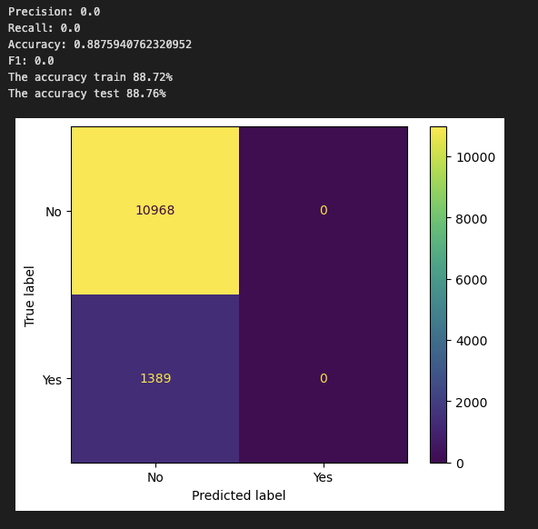

# Practical Application III: Comparing Classifiers

### Overview
In this practical application, th objective is to compare the performance of the classifiers we encountered in this section, namely K Nearest Neighbor, Logistic Regression, Decision Trees, and Support Vector Machines. We will utilize a dataset related to marketing bank products over the telephone.

### Data:
The data can be found in this link: 

[bank-additional-full.csv](https://github.com/ronalcamilo/practical_application_assignment_17_1/blob/main/data/bank-additional-full.csv)

Notebook Link
The following notebook contains all the development of the analysis carried out.

[prompt_III.ipynb](https://github.com/ronalcamilo/practical_application_assignment_17_1/blob/main/prompt_III.ipynb)

### Business Understanding
To gain a better understanding of the data, please read the information provided in the UCI link above, and examine the Materials and Methods section of the paper. How many marketing campaigns does this data represent?

This data represents 17 campaigns taken from May 2008 to November 2010.

### Read in the Data


### Understanding the Features

Input variables:
#### bank client data:
* 1 - age (numeric)
* 2 - job : type of job (categorical: 'admin.','blue-collar','entrepreneur','housemaid','management','retired','self-employed','services','student','technician','unemployed','unknown')
* 3 - marital : marital status (categorical: 'divorced','married','single','unknown'; note: 'divorced' means divorced or widowed)
* 4 - education (categorical: 'basic.4y','basic.6y','basic.9y','high.school','illiterate','professional.course','university.degree','unknown')
* 5 - default: has credit in default? (categorical: 'no','yes','unknown')
* 6 - housing: has housing loan? (categorical: 'no','yes','unknown')
* 7 - loan: has personal loan? (categorical: 'no','yes','unknown')
#### related with the last contact of the current campaign:
* 8 - contact: contact communication type (categorical: 'cellular','telephone')
* 9 - month: last contact month of year (categorical: 'jan', 'feb', 'mar', ..., 'nov', 'dec')
* 10 - day_of_week: last contact day of the week (categorical: 'mon','tue','wed','thu','fri')
* 11 - duration: last contact duration, in seconds (numeric). Important note: this attribute highly affects the output target (e.g., if duration=0 then y='no'). Yet, the duration is not known before a call is performed. Also, after the end of the call y is obviously known. Thus, this input should only be included for benchmark purposes and should be discarded if the intention is to have a realistic predictive model.
#### other attributes:
* 12 - campaign: number of contacts performed during this campaign and for this client (numeric, includes last contact)
* 13 - pdays: number of days that passed by after the client was last contacted from a previous campaign (numeric; 999 means client was not previously contacted)
* 14 - previous: number of contacts performed before this campaign and for this client (numeric)
* 15 - poutcome: outcome of the previous marketing campaign (categorical: 'failure','nonexistent','success')
#### social and economic context attributes
* 16 - emp.var.rate: employment variation rate - quarterly indicator (numeric)
* 17 - cons.price.idx: consumer price index - monthly indicator (numeric)
* 18 - cons.conf.idx: consumer confidence index - monthly indicator (numeric)
* 19 - euribor3m: euribor 3 month rate - daily indicator (numeric)
* 20 - nr.employed: number of employees - quarterly indicator (numeric)
#### Output variable (desired target):
* 21 - y - has the client subscribed a term deposit? (binary: 'yes','no')

### Nulls
We searched for nulls within the data to understand if a strategy to autocomplete that data is necessary, but we found that the dataset does not contain nulls.


### Understanding the Task
#### Analysis
once we took the data we reviewed what is the proportion of information for the column and in which we have an acceptance of 88.73 (36548) Not subscribed and 11.27 (4640) Subscribed.


#### Correlation between characteristics
After analyzing the correlations we found properties with high correlations which we proceeded to remove in order to simplify the model and to have a higher accuracy


we will only use:
* age
* job
* marital
* education
* default
* housing 
* loan
* contact 
* subscribed

#### Uniques values


### Train/Test Split
Next, I split the data

```
X_train, X_test, y_train, y_test = train_test_split(X, y, test_size = 0.2, random_state=42) 
```

###  Baseline model
Using DummyClassifier we define a baseline


###  A Simple Model
After that we create our first classifier model, this is a LogisticRegression classifier which will train the X_train data and see if the performance is better than the baseline performance, we will run it with all our features and using the default parameters for the model.


### Score the Model

What is the accuracy of your model?
```
Accurrancy score for the logistic regressor for train data is 88.72%
Accurrancy score for the logistic regressor for test data is 88.76%
```

Using the acuracy_score function we can see that the score we get is better than our baseline model.

### Model Comparisons

Using the default parameters, we ran all the classifiers models that we have seen and this are the results:


- SVC is the classifier model that took the longest to train the data and the fastest model was KNN
- The model with the highest accuracy on the test data was LogisticRegression
- All models obtained greater precision than the reference model.

| KNN | Decision Tree | SVM |
| --- | --- | --- |
|  |  |  |


### Improving the model
  
Now that we have some basic models on the board, we try to improve them. Following the next steps:

#### More feature engineering and exploration. For example, should we keep the gender feature? Why or why not?

After removing several columns due to the high correlation I have decided to remove less with respect to the initial point hoping that the characteristics that I leave will help the accuracy, I will only remove the ones that I consider to have a very high correlation.

we found characteristics with high correlations which we will remove from the dataset to have a better estimation. 
* emp.var.rate
* cons.price.idx
* nr.employed


#### Hyperparameter tuning and grid search

I will use the grid search with parameters that I believe can help to find the best estimator for the training times and considerably improve the values that we initially generated.


#### Details

| LR | KNN |
| --- | --- |
|  |   | 

| Decision Tree | SVM |
 --- | --- |
  | 

Running the models with GridSearchCV we can see better values in the training and test scores but the times increased considerably particularly in the SVM to run it on my pc in comfortable times I limited it to 10000 iterations maximum, even so after analyzing the data we can see that the accuracy did improve considerably in relation to the models without GridSearchCV.

### Findings

After analyzed different classification methods such as KNN, Logistic Regression, Decision Tree and SVM with different parameters, looking for the best results according to the classification models studied, and trying to improve in the process some values that are configurable we can find that the use of hyperparameters is much better than using the methods without them, also it can be understood that discarding the columns with high correlation and leaving only single values can considerably improve the reliability of the information. it is important to understand that there are known features such as euribor3m (interest rate) which generates a decay in the taking of an account so it is a very important feature.

the duration of some algorithms when there are many features and data can generate delays in the execution time so it is important to look for alternatives that improve these times taking only the most relevant features.

### Next Steps and Recomendations

* Collect as much data as possible in order to have the most relevant characteristics filled in.
* Review other algorithms that will help to have a greater number of options 
* Review the discarded characteristics and see if they influence an improvement on the classification.
* Refine the features with a deeper analysis to better understand the business and the significance and importance of each feature.
